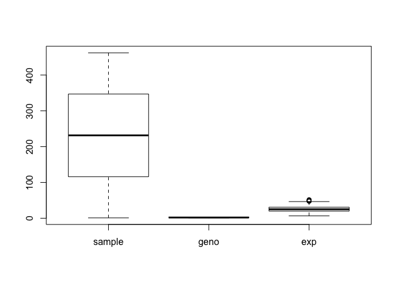
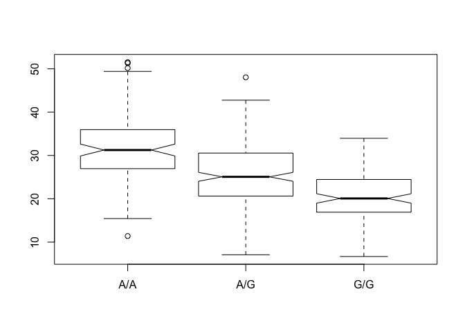

# Section 1
Q5

```r
sample <- read.csv("373531-SampleGenotypes-Homo_sapiens_Variation_Sample_rs8067378.csv")
my.table <- table(sample[,2])
my.table/nrow(sample)*100
```

```
## 
##     A|A     A|G     G|A     G|G 
## 34.3750 32.8125 18.7500 14.0625
```

You can use the R functions gtools::asc() together with the seqinr::s2c() to return the values corresponding to the specified ASCII codes.

```r
library(seqinr)
gtools::asc(seqinr::s2c("DDDDCDEDCDDDDBBDDDCC@")) - 33 # the first 33 ASCII characters have different meaning. quality value starts at 34.
```

```
##  D  D  D  D  C  D  E  D  C  D  D  D  D  B  B  D  D  D  C  C  @ 
## 35 35 35 35 34 35 36 35 34 35 35 35 35 33 33 35 35 35 34 34 31
```

# Section 4


```r
mytable <- read.table("rs8067378_ENSG00000172057.6.txt")
summary(mytable)
```

```
##      sample     geno          exp        
##  HG00096:  1   A/A:108   Min.   : 6.675  
##  HG00097:  1   A/G:233   1st Qu.:20.004  
##  HG00099:  1   G/G:121   Median :25.116  
##  HG00100:  1             Mean   :25.640  
##  HG00101:  1             3rd Qu.:30.779  
##  HG00102:  1             Max.   :51.518  
##  (Other):456
```


```r
boxplot(mytable)
```

<!-- -->


```r
AG.table <- mytable$exp[mytable$geno == "A/G"]
GG.table <- mytable$exp[mytable$geno == "G/G"]
AA.table <- mytable$exp[mytable$geno == "A/A"]

summary(AG.table)
```

```
##    Min. 1st Qu.  Median    Mean 3rd Qu.    Max. 
##   7.075  20.626  25.065  25.397  30.552  48.034
```

```r
summary(GG.table)
```

```
##    Min. 1st Qu.  Median    Mean 3rd Qu.    Max. 
##   6.675  16.903  20.074  20.594  24.457  33.956
```

```r
summary(AA.table)
```

```
##    Min. 1st Qu.  Median    Mean 3rd Qu.    Max. 
##   11.40   27.02   31.25   31.82   35.92   51.52
```

```r
length(AG.table) <- 233 #make all vectors the same length so that cbind would work
length(GG.table) <- 233
length(AA.table) <- 233

boxplot(cbind(AA.table, AG.table, GG.table))
```

<!-- -->

better way to do it

```r
boxplot(exp ~ geno, data = mytable, notch=TRUE) 
```

<!-- -->

```r
#plot exp vs geno
#notch helps visualize significance. if notch is TRUE, a notch is drawn in each side of the boxes. If the notches of two plots do not overlap this is ‘strong evidence’ that the two medians differ (Chambers et al, 1983, p. 62). See boxplot.stats for the calculations used.
```

Using ggplot2

```r
library(ggplot2)
ggplot(mytable, aes(geno, exp)) + geom_boxplot() #aes(x axis, y axix), what type of geom plot you want to add to it
```

<!-- -->


```r
ggplot(mytable, aes(exp, fill= geno)) + geom_density(alpha = 0.2) #alpha is the transparancy
```

<!-- -->

Yet another representation

```r
# Boxplot with the data shown
geno <- mytable
ggplot(geno, aes(geno, exp, fill=geno)) + 
  geom_boxplot(notch=TRUE, outlier.shape = NA) + 
  geom_jitter(shape=16, position=position_jitter(0.2), alpha=0.4)
```

<!-- -->


