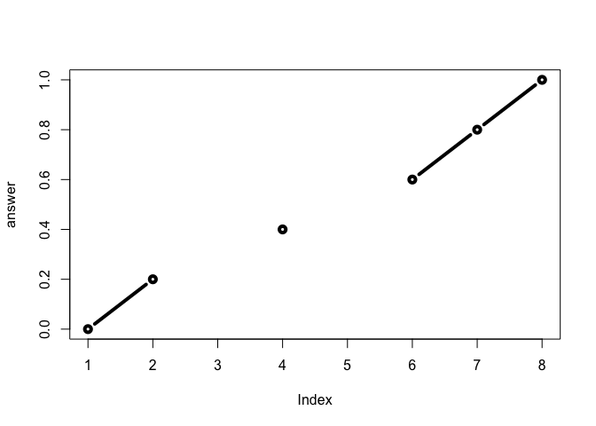
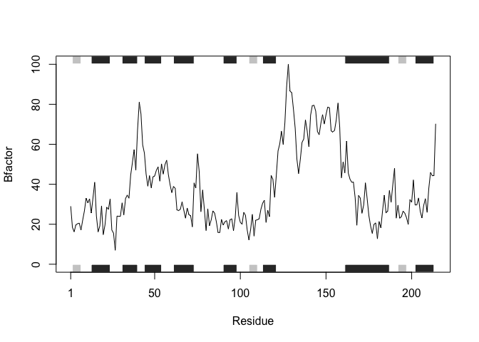
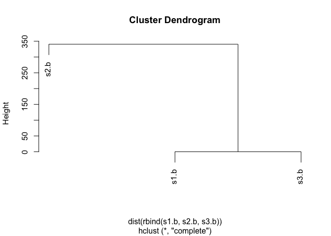

header 1
========

header 2
--------

### Let's look at the poor old function

This is the function code from Barry's student.

    #old function
    map.colors <- function (value,high.low,palette) {
      proportion <- ((value-high.low[1])/(high.low[2]-high.low[1]))
      index <- round ((length(palette)-1)*proportion)+1
      return (palette[index])
    }

### Now let's try to understand this function...

    map.colors2 <- function (x, 
                             high.low = range(x), #default value for high.low
                             palette = cm.colors(100)) {  #default value for palette
      
      # Determine where in the 'high.low' range or values of 'x' lies. 
      percent <- ( (x - high.low[1]) / (high.low[2] - high.low[1]) )
      
      # Where in the 'palette' vector of colors is this 'percent'
      index <- round ( (length(palette) - 1)* percent) + 1
      
      return (palette[index])
    }

Working with our own functions
------------------------------

My first function

    add <- function(x, y=1) {
    # Sum the input x and y
      return(x + y)
    }

Testing my first function

    add(1:20, 3)

    ##  [1]  4  5  6  7  8  9 10 11 12 13 14 15 16 17 18 19 20 21 22 23

Second function: rescale

    rescale <- function(x,na.rm = TRUE) {
       rng <-range(x)
       (x - rng[1]) / (rng[2] - rng[1])
    }

Testing 'rescale'

    rescale(c(1,2,3,NA,5))

    ## [1] NA NA NA NA NA

Update second function: rescale2

    rescale2 <- function(x,
                        na.rm = TRUE,
                        plot = FALSE) {
       if(na.rm) {
         rng <- range(x, na.rm=na.rm)  #na.rm is a logical that indicates if NA's should be ommited
       } else {
         rng <- range(x)
       }
       
       print("Hello")
       
       answer <- (x - rng[1]) / (rng[2] - rng[1])
       

       
       print("is it me you are looking for?")
       
       if(plot) {
         plot(answer, typ="b", lwd=4)
    }
      
       print("I can see it in ...")

       return(answer)
    }

Testing rescale2

    rescale2(c(1,2,NA,3,NA,4,5,6), plot = TRUE)

    ## [1] "Hello"
    ## [1] "is it me you are looking for?"

    ## [1] "I can see it in ..."

    ## [1] 0.0 0.2  NA 0.4  NA 0.6 0.8 1.0

Section 1B
==========

    # Can you improve this analysis code?
    library(bio3d)
    s1 <- read.pdb("4AKE")  # kinase with drug

    ##   Note: Accessing on-line PDB file

    s2 <- read.pdb("1AKE")  # kinase no drug

    ##   Note: Accessing on-line PDB file
    ##    PDB has ALT records, taking A only, rm.alt=TRUE

    s3 <- read.pdb("1E4Y")  # kinase with drug

    ##   Note: Accessing on-line PDB file

    s1.chainA <- trim.pdb(s1, chain="A", elety="CA")
    s2.chainA <- trim.pdb(s2, chain="A", elety="CA")
    s3.chainA <- trim.pdb(s1, chain="A", elety="CA")
    s1.b <- s1.chainA$atom$b
    s2.b <- s2.chainA$atom$b
    s3.b <- s3.chainA$atom$b
    plotb3(s1.b, sse=s1.chainA, typ="l", ylab="Bfactor")

    plotb3(s2.b, sse=s2.chainA, typ="l", ylab="Bfactor")

    plotb3(s3.b, sse=s3.chainA, typ="l", ylab="Bfactor")

    hc <- hclust( dist( rbind(s1.b, s2.b, s3.b) ) )
    plot(hc)

Breaking it down to better understand the program

    library(bio3d)
    s1 <- read.pdb("4AKE")  # kinase with drug

    ##   Note: Accessing on-line PDB file

    ## Warning in get.pdb(file, path = tempdir(), verbose = FALSE): /var/folders/
    ## b6/nvz8935j0853q86wq1fj2_xc0000gn/T//Rtmplfe31p/4AKE.pdb exists. Skipping
    ## download

    s1$remark

    ## $biomat
    ## $biomat$num
    ## [1] 1
    ## 
    ## $biomat$chain
    ## $biomat$chain[[1]]
    ## [1] "A" "B"
    ## 
    ## 
    ## $biomat$mat
    ## $biomat$mat[[1]]
    ## $biomat$mat[[1]]$`A B`
    ##      [,1] [,2] [,3] [,4]
    ## [1,]    1    0    0    0
    ## [2,]    0    1    0    0
    ## [3,]    0    0    1    0
    ## 
    ## 
    ## 
    ## $biomat$method
    ## [1] "AUTHOR"

    s1.chainA <- trim.pdb(s1, chain="A", elety="CA")
    s1.chainA$helix

    ## $start
    ##                                     
    ##  13  31  44  61  75  90 113 161 202 
    ## 
    ## $end
    ##                                     
    ##  24  40  54  73  77  98 121 187 213 
    ## 
    ## $chain
    ## [1] "A" "A" "A" "A" "A" "A" "A" "A" "A"
    ## 
    ## $type
    ## [1] "5" "1" "1" "1" "5" "1" "1" "1" "1"

    s1.b <- s1.chainA$atom$b
    s1.b

    ##   [1]  29.02  18.44  16.20  19.67  20.26  20.55  17.05  22.13  26.71  33.05
    ##  [11]  30.66  32.73  25.61  33.19  41.03  24.09  16.18  19.14  29.19  14.79
    ##  [21]  19.63  28.54  27.49  32.56  17.13  15.50   6.98  24.07  24.00  23.94
    ##  [31]  30.70  24.70  32.84  34.60  33.01  44.60  50.74  57.32  47.04  67.13
    ##  [41]  81.04  75.20  59.68  55.63  45.12  39.04  44.31  38.21  43.70  44.19
    ##  [51]  47.00  48.67  41.54  50.22  45.07  49.77  52.04  44.82  39.75  35.79
    ##  [61]  38.92  37.93  27.18  26.86  27.53  31.16  27.08  23.03  28.12  24.78
    ##  [71]  24.22  18.69  40.67  38.08  55.26  46.29  26.25  37.14  27.50  16.86
    ##  [81]  27.76  19.27  22.22  26.70  25.52  21.22  15.90  15.84  22.44  19.61
    ##  [91]  21.23  21.79  17.64  22.19  22.73  16.80  23.25  35.95  24.42  20.96
    ## [101]  20.00  25.99  24.39  17.19  12.16  17.35  24.97  14.08  22.01  22.26
    ## [111]  22.78  27.47  30.49  32.02  20.90  27.03  23.84  44.37  42.47  33.48
    ## [121]  44.56  56.67  60.18  66.62  59.95  70.81  88.63 100.11  86.60  85.80
    ## [131]  77.48  68.13  52.66  45.34  52.43  60.90  62.64  72.19  66.75  58.73
    ## [141]  74.57  79.29  79.53  76.58  66.40  64.76  70.48  74.84  70.11  74.82
    ## [151]  78.61  78.24  66.70  66.10  67.01  72.28  80.64  68.54  43.23  51.24
    ## [161]  45.72  61.60  45.61  42.57  41.03  41.02  33.34  19.48  34.38  33.11
    ## [171]  25.48  29.68  40.71  32.91  24.41  19.20  15.43  19.93  20.66  12.72
    ## [181]  21.40  18.21  26.68  34.50  25.77  26.52  36.85  31.05  39.84  48.03
    ## [191]  23.04  29.57  23.00  23.80  26.59  25.49  23.25  19.89  32.37  30.97
    ## [201]  42.16  29.64  29.69  33.15  26.38  23.17  29.35  32.80  25.92  38.01
    ## [211]  45.95  44.26  44.35  70.26

    plotb3(s1.b, sse=s1.chainA, typ="l", ylab="Bfactor")

Generalize as a function

    # Can you improve this analysis code?
    library(bio3d)
    s1 <- read.pdb("4AKE")  # kinase with drug

    ##   Note: Accessing on-line PDB file

    ## Warning in get.pdb(file, path = tempdir(), verbose = FALSE): /var/folders/
    ## b6/nvz8935j0853q86wq1fj2_xc0000gn/T//Rtmplfe31p/4AKE.pdb exists. Skipping
    ## download

    s2 <- read.pdb("1AKE")  # kinase no drug

    ##   Note: Accessing on-line PDB file

    ## Warning in get.pdb(file, path = tempdir(), verbose = FALSE): /var/folders/
    ## b6/nvz8935j0853q86wq1fj2_xc0000gn/T//Rtmplfe31p/1AKE.pdb exists. Skipping
    ## download

    ##    PDB has ALT records, taking A only, rm.alt=TRUE

    s3 <- read.pdb("1E4Y")  # kinase with drug

    ##   Note: Accessing on-line PDB file

    ## Warning in get.pdb(file, path = tempdir(), verbose = FALSE): /var/folders/
    ## b6/nvz8935j0853q86wq1fj2_xc0000gn/T//Rtmplfe31p/1E4Y.pdb exists. Skipping
    ## download

    s1.chainA <- trim.pdb(s1, chain="A", elety="CA")
    s2.chainA <- trim.pdb(s2, chain="A", elety="CA")
    s3.chainA <- trim.pdb(s1, chain="A", elety="CA")
    s1.b <- s1.chainA$atom$b
    s2.b <- s2.chainA$atom$b
    s3.b <- s3.chainA$atom$b
    plotb3(s1.b, sse=s1.chainA, typ="l", ylab="Bfactor")

    plotb3(s2.b, sse=s2.chainA, typ="l", ylab="Bfactor")

    plotb3(s3.b, sse=s3.chainA, typ="l", ylab="Bfactor")

