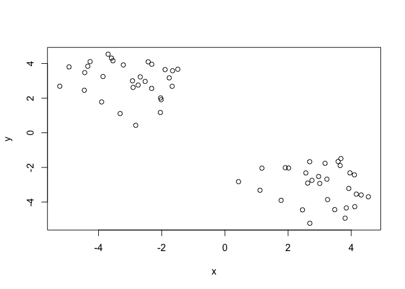
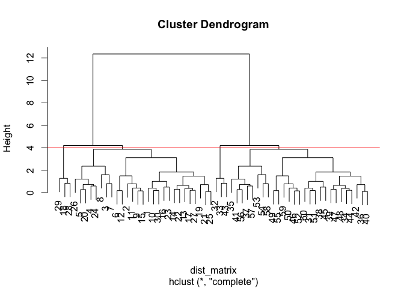
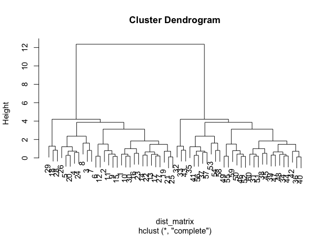
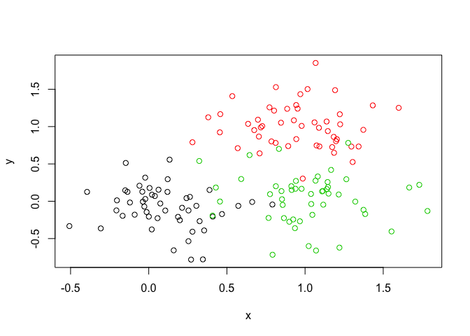
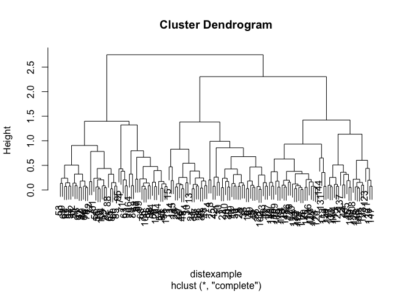

k-means clustering example
==========================

Let's make up some datafor testing the 'kmeans()' function

    tmp <- c(rnorm(30,-3), rnorm(30,3)) #a vector of points from two random distributions
    x <- cbind(x=tmp, y=rev(tmp)) #binding it in a matrix with two columns, one with tmp and one with the reverse of tmp
    plot(x)

    km <- kmeans(x, centers = 2, nstart = 10)

Use the kmeans() function setting k to 2 and nstart=20 Inspect/print the
results Q. How many points are in each cluster?

    km$size

    ## [1] 30 30

Q. What ‘component’ of your result object details - cluster size?

    km$cluster

    ##  [1] 1 1 1 1 1 1 1 1 1 1 1 1 1 1 1 1 1 1 1 1 1 1 1 1 1 1 1 1 1 1 2 2 2 2 2
    ## [36] 2 2 2 2 2 2 2 2 2 2 2 2 2 2 2 2 2 2 2 2 2 2 2 2 2

      - cluster assignment/membership?
      - cluster center?

    km$centers

    ##           x         y
    ## 1 -3.033434  3.031429
    ## 2  3.031429 -3.033434

Plot x colored by the kmeans cluster assignment and add cluster centers
as blue points

    plot(x, col = km$cluster, pch = 16) #plot the data with coloring for each cluster
    points(km$centers, col = "blue", pch = 16) #points() adds points on top of the graph

Hierarchical clustering:
========================

First we need to calculate point (dis)similarity as the Euclidean
distance between observations

    dist_matrix <- dist(x) #calculates all pairwise distances.
    dim(dist_matrix) #doesn't work as dist_matrix is not a dataframe.

    ## NULL

    dmatrix <- as.matrix(dist_matrix)
    #View( dmatrix ) #view() works with dataframe. as.matrix() forces it to be a matrix.
    dim(x) #60 points

    ## [1] 60  2

    dim( as.matrix(dist_matrix) ) #60x60 pairwise distances

    ## [1] 60 60

Now let's use hc()

    hc <- hclust(dist_matrix) #calculate the hierachical clustering
    plot(hc) #plot as a dendogram
    abline(h=4, col="red") #add a 'cutoff' line on the dendogram.

Cut the tree by height...

    groups <- cutree(hc, h=6) #cut by height=4
    groups

    ##  [1] 1 1 1 1 1 1 1 1 1 1 1 1 1 1 1 1 1 1 1 1 1 1 1 1 1 1 1 1 1 1 2 2 2 2 2
    ## [36] 2 2 2 2 2 2 2 2 2 2 2 2 2 2 2 2 2 2 2 2 2 2 2 2 2

    table(groups)

    ## groups
    ##  1  2 
    ## 30 30

Plot it

    plot(x, col=cutree(hc, h=6))

... or by k

    kgroups <- cutree(hc, k=4) #cut by k=4
    table(kgroups)

    ## kgroups
    ##  1  2  3  4 
    ## 27  3 27  3

and plot it

    plot(x, col=cutree(hc, k=4))

Using different hierarchical clustering methods to check how consistent
it is

    hc.complete <- hclust(dist_matrix, method="complete")
    plot(hc.complete)

    hc.average  <- hclust(dist_matrix, method="average")
    hc.single   <- hclust(dist_matrix, method="single")

Exercise
========

Step 1. Generate some example data for clustering

    x <- rbind(
      matrix(rnorm(100, mean=0, sd = 0.3), ncol = 2),   # c1
      matrix(rnorm(100, mean = 1, sd = 0.3), ncol = 2), # c2
      matrix(c(rnorm(50, mean = 1, sd = 0.3),           # c3
               rnorm(50, mean = 0, sd = 0.3)), ncol = 2))
    colnames(x) <- c("x", "y")
    str(x)

    ##  num [1:150, 1:2] 0.254 0.074 0.573 -0.307 0.213 ...
    ##  - attr(*, "dimnames")=List of 2
    ##   ..$ : NULL
    ##   ..$ : chr [1:2] "x" "y"

Step 2. Plot the data without clustering

    plot(x)

Step 3. Generate colors for known clusters (just so we can compare to
hclust results)

    col <- as.factor( rep(c("c1","c2","c3"), each=50) )
    plot(x, col=col)

    distexample <- dist(x) #calculate distances
    clustexample <- hclust(distexample)
    plot(clustexample) #plot as a dendogram

and then plot the data with different groupings

    plot(x, col=cutree(hc, k=2))

The clustering is not great! The differences between the different
groups are relatively small. Let's try k-means to see if it gets better
with a different method.

    kmexample <- kmeans(x, centers = 2, nstart = 10)
    plot(x, col= kmexample$cluster)

looks better!

Principal Component Analysis (PCA)
==================================

Let's retrieve the data and plot it

    mydata <- read.csv("https://tinyurl.com/expression-CSV", row.names=1)
    mydata$wt1

    ##   [1]  439  219 1006  783  181  460   27  175  658  121  337  214  789  458
    ##  [15]  551  390  900  951  436  244  119  156   89  570  788 1007  937  224
    ##  [29]  809  624  218  906  262  155  100  117  286  321  388  606  379  471
    ##  [43]  592  755   35  758   24  100  809  955  453  327  657  678  304  659
    ##  [57]  673  785  501  232  928  159  336  968  339   35   27   80  744  766
    ##  [71]  672  526  627  468  986  348  719  883  837  666  804  476  438  938
    ##  [85]   29  810  575  451  174  158  371  853  208  555  527  589  396   33
    ##  [99]  321   25

    plot(mydata$wt1)

    plot(mydata$ko1)

    plot(mydata)

Let's call prcomp() to do PCA. However, prcomp() expects the samples to
be rows and genes to be columns so we need to first transpose the matrix
with the t() function.

    pca <- prcomp(t(mydata), scale=TRUE) #
    attributes(pca) #pca$x contains the PCs for drawing our first graph.

    ## $names
    ## [1] "sdev"     "rotation" "center"   "scale"    "x"       
    ## 
    ## $class
    ## [1] "prcomp"

look at pca$x

    pca$x

    ##           PC1        PC2        PC3        PC4        PC5        PC6
    ## wt1 -9.697374  1.5233313 -0.2753567  0.7322391 -0.6749398 -1.1823860
    ## wt2 -9.138950  0.3748504  1.0867958 -1.9461655  0.7571209  0.4369228
    ## wt3 -9.054263 -0.9855163  0.4152966  1.4166028  0.5835918 -0.6937236
    ## wt4 -8.731483 -0.7468371  0.5875748  0.2268129 -1.5404775  1.2723618
    ## wt5 -9.006312 -0.2945307 -1.8498101 -0.4303812  0.8666124  0.2496025
    ## ko1  8.846999  2.2345475 -0.1462750 -1.1544333 -0.6947862 -0.7128021
    ## ko2  9.213885 -3.2607503  0.2287292 -0.7658122 -0.4922849 -0.9170241
    ## ko3  9.458412 -0.2636283 -1.5778183  0.2433549  0.3654124  0.5837724
    ## ko4  8.883412  0.6339701  1.5205064  0.7760158  1.2158376  0.1446094
    ## ko5  9.225673  0.7845635  0.0103574  0.9017667 -0.3860869  0.8186668
    ##             PC7         PC8         PC9         PC10
    ## wt1  0.24446614  1.03519396  0.07010231 3.691492e-15
    ## wt2  0.03275370  0.26622249  0.72780448 3.080869e-15
    ## wt3  0.03578383 -1.05851494  0.52979799 2.595146e-15
    ## wt4  0.52795595 -0.20995085 -0.50325679 3.122502e-15
    ## wt5 -0.83227047 -0.05891489 -0.81258430 3.302913e-15
    ## ko1  0.07864392 -0.94652648 -0.24613776 3.351486e-15
    ## ko2 -0.30945771  0.33231138 -0.08786782 2.629841e-15
    ## ko3  1.43723425  0.14495188  0.56617746 3.094747e-15
    ## ko4  0.35073859  0.30381920 -0.87353886 2.983724e-15
    ## ko5 -1.56584821  0.19140827  0.62950330 3.233525e-15

Lets plot the new PCA data: PC1 vs PC2

    plot(pca$x[,1], pca$x[,2])

Calculate the variance

     ## Variance captured per PC
    pca.var <- pca$sdev^2
    pca.var

    ##  [1] 9.261625e+01 2.309940e+00 1.119081e+00 1.106773e+00 7.754851e-01
    ##  [6] 6.813705e-01 6.417798e-01 3.852003e-01 3.641185e-01 1.121154e-29

    pca.var.per <- round(pca.var/sum(pca.var)*100, 1) #percent value, rounded to make it look good
    pca.var.per

    ##  [1] 92.6  2.3  1.1  1.1  0.8  0.7  0.6  0.4  0.4  0.0

Plot the variance

    barplot(pca.var.per, main="Scree Plot", xlab="Principal Component", ylab="Percent Variation")

Make the plot more useful

    # I want to make a vector of colors for wt and ko samples
    colnames(mydata) # I want my factors to be WT and KO only, not WT1 to WT5 and KO1 to KO5

    ##  [1] "wt1" "wt2" "wt3" "wt4" "wt5" "ko1" "ko2" "ko3" "ko4" "ko5"

    substr( colnames(mydata), 1, 2) #use substring substr() to remove the extra info.

    ##  [1] "wt" "wt" "wt" "wt" "wt" "ko" "ko" "ko" "ko" "ko"

    colvec <- as.factor( substr( colnames(mydata), 1, 2) ) #make a vector for colors.

Use the new vector to color WT and KO with two different colors

    plot(pca$x[,1], pca$x[,2], col=colvec, pch=16, 
         xlab=paste0("PC1 (", pca.var.per[1], "%)"), #paste() concatenates strings
         ylab=paste0("PC2 (", pca.var.per[2], "%)"))
    text(pca$x[,1], pca$x[,2], labels = colnames(mydata), pos=1) #adding text labels.

    #identify(pca$x[,1], pca$x[,2], labels = colnames(mydata)) #run this then click on the points on the graph that you want to identify, press ESC and it will tell you which points those are.

UK food exercise
================

    UK_foods <- read.csv("UK_foods.csv")

    #pcafoods <- prcomp(UK_foods, scale=TRUE)

First column is the name of the rows.

    updtUKfoods <- UK_foods[,2:5]
    row.names(updtUKfoods) <- UK_foods$X #alternatively, you can use x <- x[,-1] to remove column 1
    plot(updtUKfoods)

Use PCA on the dataset

    pcafoods <- prcomp(t(updtUKfoods), scale=TRUE)
    plot(pcafoods$x[,1], pcafoods$x[,2])
    text(pcafoods$x[,1], pcafoods$x[,2], labels = colnames(updtUKfoods))

Calculate variance

    pcafoods.var <- pcafoods$sdev^2
    pcafoods.var.per <- round(pcafoods.var/sum(pcafoods.var)*100, 1)
    barplot(pcafoods.var.per, main="Scree Plot", xlab="Principal Component", ylab="Percent Variation")

Try building a heatmap

    heatmap(as.matrix(updtUKfoods))

