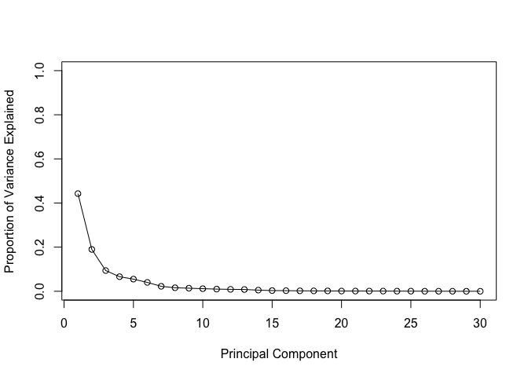

Section 1
=========

Import data from csv file:

    wisc.df <- read.csv("WisconsinCancer.csv")
    wisc.matrix <- as.matrix(wisc.df)
    row.names(wisc.matrix) <- wisc.df$id

Let's make a new data matrix with just the numeric values of interest =
get columns 3 to 32

    wisc.data <- as.matrix(wisc.df[,3:32]) #note that row 33 is full of NAs that might screw up further analyses

Finally, setup a separate new vector called diagnosis to be 1 if a
diagnosis is malignant ("M") and 0 otherwise. Note that R coerces TRUE
to 1 and FALSE to 0.

    diagnosis <- as.numeric(wisc.df$diagnosis == "M")

Q1. How many observations are in this dataset?

    dim(wisc.matrix)

    ## [1] 569  33

Q2. How many variables/features in the data are suffixed with \_mean?

    length(grep("_mean", colnames(wisc.data)))

    ## [1] 10

Q3. How many of the observations have a malignant diagnosis?

    sum(diagnosis)

    ## [1] 212

Section 2
=========

The next step in your analysis is to perform principal component
analysis (PCA) on wisc.data. Two common reasons for scaling data
include: different units and/or significantly different variances.

Check the mean and standard deviation of the features (i.e. columns) of
the wisc.data to determine if the data should be scaled. Use the
colMeans() and apply() functions like you’ve done before.

Check column means and standard deviations
==========================================

    colMeans(wisc.data)

    ##             radius_mean            texture_mean          perimeter_mean 
    ##            1.412729e+01            1.928965e+01            9.196903e+01 
    ##               area_mean         smoothness_mean        compactness_mean 
    ##            6.548891e+02            9.636028e-02            1.043410e-01 
    ##          concavity_mean     concave.points_mean           symmetry_mean 
    ##            8.879932e-02            4.891915e-02            1.811619e-01 
    ##  fractal_dimension_mean               radius_se              texture_se 
    ##            6.279761e-02            4.051721e-01            1.216853e+00 
    ##            perimeter_se                 area_se           smoothness_se 
    ##            2.866059e+00            4.033708e+01            7.040979e-03 
    ##          compactness_se            concavity_se       concave.points_se 
    ##            2.547814e-02            3.189372e-02            1.179614e-02 
    ##             symmetry_se    fractal_dimension_se            radius_worst 
    ##            2.054230e-02            3.794904e-03            1.626919e+01 
    ##           texture_worst         perimeter_worst              area_worst 
    ##            2.567722e+01            1.072612e+02            8.805831e+02 
    ##        smoothness_worst       compactness_worst         concavity_worst 
    ##            1.323686e-01            2.542650e-01            2.721885e-01 
    ##    concave.points_worst          symmetry_worst fractal_dimension_worst 
    ##            1.146062e-01            2.900756e-01            8.394582e-02

    plot(colMeans(wisc.data), type = "o")

    apply(wisc.data, #apply(x, MARGIN, FUN)
          2,  #where MARGIN = 1 if rows and =2 if columns
          sd)   #function applied

    ##             radius_mean            texture_mean          perimeter_mean 
    ##            3.524049e+00            4.301036e+00            2.429898e+01 
    ##               area_mean         smoothness_mean        compactness_mean 
    ##            3.519141e+02            1.406413e-02            5.281276e-02 
    ##          concavity_mean     concave.points_mean           symmetry_mean 
    ##            7.971981e-02            3.880284e-02            2.741428e-02 
    ##  fractal_dimension_mean               radius_se              texture_se 
    ##            7.060363e-03            2.773127e-01            5.516484e-01 
    ##            perimeter_se                 area_se           smoothness_se 
    ##            2.021855e+00            4.549101e+01            3.002518e-03 
    ##          compactness_se            concavity_se       concave.points_se 
    ##            1.790818e-02            3.018606e-02            6.170285e-03 
    ##             symmetry_se    fractal_dimension_se            radius_worst 
    ##            8.266372e-03            2.646071e-03            4.833242e+00 
    ##           texture_worst         perimeter_worst              area_worst 
    ##            6.146258e+00            3.360254e+01            5.693570e+02 
    ##        smoothness_worst       compactness_worst         concavity_worst 
    ##            2.283243e-02            1.573365e-01            2.086243e-01 
    ##    concave.points_worst          symmetry_worst fractal_dimension_worst 
    ##            6.573234e-02            6.186747e-02            1.806127e-02

    plot(apply(wisc.data, 2, sd), type = "o")

Since the standard deviations vary from 10^-3 to 10^+2, I will apply
scaling

    wisc.pr <- prcomp(wisc.data, scale = TRUE)
    plot(wisc.pr)

    summary(wisc.pr)

    ## Importance of components:
    ##                           PC1    PC2     PC3     PC4     PC5     PC6
    ## Standard deviation     3.6444 2.3857 1.67867 1.40735 1.28403 1.09880
    ## Proportion of Variance 0.4427 0.1897 0.09393 0.06602 0.05496 0.04025
    ## Cumulative Proportion  0.4427 0.6324 0.72636 0.79239 0.84734 0.88759
    ##                            PC7     PC8    PC9    PC10   PC11    PC12
    ## Standard deviation     0.82172 0.69037 0.6457 0.59219 0.5421 0.51104
    ## Proportion of Variance 0.02251 0.01589 0.0139 0.01169 0.0098 0.00871
    ## Cumulative Proportion  0.91010 0.92598 0.9399 0.95157 0.9614 0.97007
    ##                           PC13    PC14    PC15    PC16    PC17    PC18
    ## Standard deviation     0.49128 0.39624 0.30681 0.28260 0.24372 0.22939
    ## Proportion of Variance 0.00805 0.00523 0.00314 0.00266 0.00198 0.00175
    ## Cumulative Proportion  0.97812 0.98335 0.98649 0.98915 0.99113 0.99288
    ##                           PC19    PC20   PC21    PC22    PC23   PC24
    ## Standard deviation     0.22244 0.17652 0.1731 0.16565 0.15602 0.1344
    ## Proportion of Variance 0.00165 0.00104 0.0010 0.00091 0.00081 0.0006
    ## Cumulative Proportion  0.99453 0.99557 0.9966 0.99749 0.99830 0.9989
    ##                           PC25    PC26    PC27    PC28    PC29    PC30
    ## Standard deviation     0.12442 0.09043 0.08307 0.03987 0.02736 0.01153
    ## Proportion of Variance 0.00052 0.00027 0.00023 0.00005 0.00002 0.00000
    ## Cumulative Proportion  0.99942 0.99969 0.99992 0.99997 1.00000 1.00000

Q4. From your results, what proportion of the original variance is
captured by the first principal components (PC1)?

    pca.var <- wisc.pr$sdev^2 ## Variance captured per PC
    pca.var.per <- round(pca.var/sum(pca.var), 4) #percent value, rounded to make it look good
    barplot(pca.var.per, main="Scree Plot", xlab="Principal Component", ylab="Percent Variation")

Q5. How many principal components (PCs) are required to describe at
least 70% of the original variance in the data? Q6. How many principal
components (PCs) are required to describe at least 90% of the original
variance in the data?

    sum(pca.var.per[1:2])

    ## [1] 0.6324

    sum(pca.var.per[1:3])

    ## [1] 0.7263

    sum(pca.var.per[1:6])

    ## [1] 0.8875

    sum(pca.var.per[1:7]) # also see cummulative sum 'cumsum()' in the next section

    ## [1] 0.91

Interpreting PCA results
------------------------

A common visualization for PCA results is the so-called biplot (rownames
are used as the plotting character)

    biplot(wisc.pr)

Lets generate a more standard scatter plot of each observation along PC1
and PC2

    plot(wisc.pr$x[,1], wisc.pr$x[,2], col = diagnosis +1, xlab = "PC1", ylab = "PC2")  #col = 0 removing the points. Use col = 1 and col = 2, i.e. diagnosis +1)

Q8. Repeat the same for principal components 1 and 3. What do you notice
about these plots?

    plot(wisc.pr$x[,c(1,3)], col = diagnosis +1, xlab = "PC1", ylab = "PC3") 

Because principal component 2 explains more variance in the original
data than principal component 3, you can see that the first plot has a
cleaner cut separating the two subgroups. Overall, the plots indicate
that principal component 1 is capturing a separation of malignant from
benign samples.

Variance explained
==================

Scree plot

    # Variance explained by each principal component: pve
    pve <- pca.var.per
    # Plot variance explained for each principal component
    plot(pve, xlab = "Principal Component", 
         ylab = "Proportion of Variance Explained", 
         ylim = c(0, 1), type = "o")

or as a barplot

    barplot(pve, 
            names.arg=paste("PC",1:length(pca.var.per)), 
            main="Scree Plot", xlab="Principal Component", ylab="Percent Variation", 
            las=2,  #las = 2 for rotate axis labes 
            axes = FALSE)  #remove axes
    axis(2, at = pve, labels = round (pca.var.per,2)*100) #play around with axis labeling

Using the cumsum() function, create a plot of cumulative proportion of
variance explained.

    # Plot cumulative proportion of variance explained
    plot(cumsum(pve), xlab = "Principal Component", 
         ylab = "Cumulative Proportion of Variance Explained", 
         ylim = c(0, 1), type = "o")

Use the par() function to create a side by side plot (i.e. 1 row 2
column arrangement) of these two graphs.

    #check this out later

Section 3: Hierarchical clustering of case data
===============================================

note: Scoring section for each sample = Sum for(i=1, i++, (Read
Count)gene\_i \* influence on PC1\_i. do it for all PCs

Preparation for hierarchical clustering: compute distance between all
pairs of observations.

Scale the wisc.data data and assign the result to data.scaled.

    data.scaled <- scale(wisc.data)
    data.dist <- dist(data.scaled)
    wisc.hclust <- hclust(data.dist, method = "complete")
    plot(wisc.hclust)
    abline(h=20, col="red")

cut into 4 clusters and check diagnosis for each one of them

    wisc.hclust.clusters <- cutree(wisc.hclust, k=4)
    table(wisc.hclust.clusters, diagnosis)

    ##                     diagnosis
    ## wisc.hclust.clusters   0   1
    ##                    1  12 165
    ##                    2   2   5
    ##                    3 343  40
    ##                    4   0   2

Q12. Can you find a better cluster vs diagnoses match with by cutting
into a different number of clusters between 2 and 10?

    wisc.hclust.clusters <- cutree(wisc.hclust, k=4)
    table(wisc.hclust.clusters, diagnosis)

    ##                     diagnosis
    ## wisc.hclust.clusters   0   1
    ##                    1  12 165
    ##                    2   2   5
    ##                    3 343  40
    ##                    4   0   2

Section 4: K-means clustering and comparing results
===================================================

    wisc.km <- kmeans(data.scaled, centers= 2, nstart= 20)
    table(wisc.km$cluster, diagnosis)

    ##    diagnosis
    ##       0   1
    ##   1  14 175
    ##   2 343  37

Q13. How well does k-means separate the two diagnoses? How does it
compare to your hclust results? Use the table() function to compare the
cluster membership of the k-means model (wisc.km$cluster) to your
hierarchical clustering model from above (wisc.hclust.clusters). Recall
the cluster membership of the hierarchical clustering model is contained
in wisc.hclust.clusters object.

    table(wisc.hclust.clusters, wisc.km$cluster)

    ##                     
    ## wisc.hclust.clusters   1   2
    ##                    1 160  17
    ##                    2   7   0
    ##                    3  20 363
    ##                    4   2   0

Looking at the second table you generated, it looks like clusters 1, 2,
and 4 from the hierarchical clustering model can be interpreted as the
cluster 1 equivalent from the k-means algorithm, and cluster 3 can be
interpreted as the cluster 2 equivalent.

Section 5. Clustering on PCA results
====================================

    ## Use the distance along the first 7 PCs for clustering i.e. wisc.pr$x[, 1:7]
    wisc.pr.hclust <- hclust(dist(wisc.pr$x[,1:7]), method = "ward.D2")
    wisc.pr.hclust.clusters <- cutree(wisc.pr.hclust, k=2)
    plot(wisc.pr.hclust)  #this is now much better. There are now clearly two groups

in table form comparing to the diagnosis

    table(wisc.pr.hclust.clusters, diagnosis)

    ##                        diagnosis
    ## wisc.pr.hclust.clusters   0   1
    ##                       1  28 188
    ##                       2 329  24

plot it

    plot(wisc.pr$x[,1:2], col=wisc.pr.hclust.clusters)

compare the different approaches:

    table(wisc.hclust.clusters, wisc.km$cluster)

    ##                     
    ## wisc.hclust.clusters   1   2
    ##                    1 160  17
    ##                    2   7   0
    ##                    3  20 363
    ##                    4   2   0

Section 6: sensitivity
======================

Sensitivity refers to a test’s ability to correctly detect ill patients
who do have the condition. Count of M in malignant cluster / total count
of M.

Specificity relates to a test’s ability to correctly reject healthy
patients without a condition. Count of B in benigh cluster / total count
of B.

Q16. Which of your analysis procedures resulted in a clustering model
with the best specificity? How about sensitivity?

    library(rgl)

Bonus content:
==============

    ##predictiong malignancy of new samples

    url <- "https://tinyurl.com/new-samples-CSV"
    new <- read.csv(url)
    npc <-  predict(wisc.pr, newdata=new)

    plot(wisc.pr$x[,1:2], col=wisc.pr.hclust.clusters)
    points(npc[,1], npc[,2], col=c("purple", "blue"), pch=16, cex = 3)

